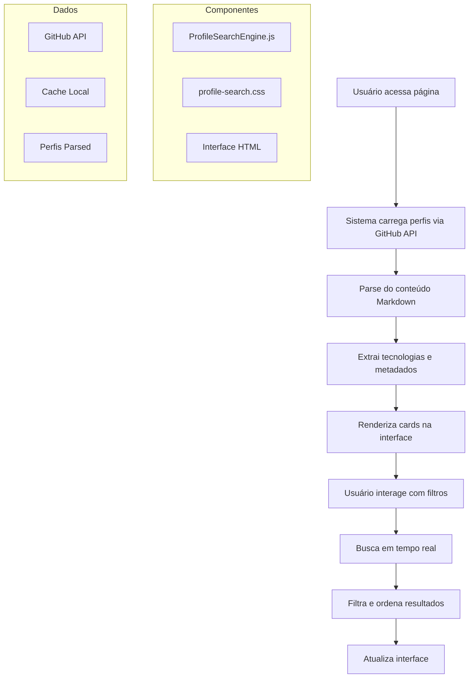

# 🚀 Melhoria: Sistema de Busca Avançada para Perfis DIO

## 📋 Resumo da Melhoria

Esta melhoria adiciona um **Sistema de Busca Avançada** à página de visualização de perfis do projeto DIO Lab Open Source, permitindo aos usuários encontrar perfis de forma mais eficiente e intuitiva.

## 🎯 Problema Resolvido

**Antes:** A página permitia apenas busca simples por username, tornando difícil encontrar perfis específicos entre milhares de contribuições.

**Agora:** Sistema completo de busca e filtros que permite encontrar perfis por:
- Nome de usuário
- Título do perfil
- Tecnologias mencionadas
- Conteúdo do perfil
- Filtros por tecnologia específica
- Ordenação personalizada

## ✨ Funcionalidades Implementadas

### 1. **Busca Inteligente**
- Busca em tempo real por nome, título, tecnologias e conteúdo
- Debounce para otimizar performance
- Cache de resultados para melhor experiência

### 2. **Filtros Avançados**
- Filtro por tecnologias específicas (JavaScript, Python, React, etc.)
- Ordenação por usuário, título ou quantidade de tecnologias
- Botão para limpar todos os filtros

### 3. **Interface Moderna**
- Cards responsivos com preview dos perfis
- Animações suaves e transições
- Design consistente com a identidade visual da DIO
- Suporte a modo escuro

### 4. **Performance Otimizada**
- Carregamento assíncrono dos perfis
- Limitação inicial de 100 perfis para performance
- Parsing inteligente do conteúdo Markdown
- Estados de loading e erro

## 🛠️ Arquivos Modificados/Criados

### Novos Arquivos:
- `docs/assets/js/profile-search.js` - Sistema principal de busca
- `docs/assets/css/profile-search.css` - Estilos para a nova interface
- `MELHORIA-SISTEMA-BUSCA.md` - Esta documentação

### Arquivos Modificados:
- `docs/index.html` - Interface atualizada com novos filtros
- `docs/assets/css/styles.css` - (mantido compatível)

## 🔧 Como Funciona

### Arquitetura do Sistema



### 1. **Carregamento de Perfis**
```javascript
// Busca arquivos na pasta community via GitHub API
const response = await fetch('https://api.github.com/repos/digitalinnovationone/dio-lab-open-source/contents/community');
```

### 2. **Parsing Inteligente**
```javascript
// Extrai informações estruturadas de cada perfil
const technologies = this.extractTechnologies(content);
const contacts = this.extractContacts(content);
const preview = content.substring(0, 200).trim();
```

### 3. **Busca e Filtros**
```javascript
// Filtra perfis baseado nos critérios selecionados
this.filteredProfiles = this.profiles.filter(profile => {
    const matchesSearch = /* lógica de busca */;
    const matchesTechnology = /* lógica de filtro */;
    return matchesSearch && matchesTechnology;
});
```

## 🎨 Interface Visual

### Elementos Principais:
- **Barra de busca** com ícone e placeholder intuitivo
- **Filtros dropdown** para tecnologias e ordenação
- **Grid responsivo** de cards de perfis
- **Estados visuais** para loading, erro e sem resultados

### Cards de Perfil:
- Título e username destacados
- Preview do conteúdo
- Badges das tecnologias
- Botão de ação para ver perfil completo

## 📱 Responsividade

- **Desktop:** Grid de 3-4 colunas
- **Tablet:** Grid de 2 colunas
- **Mobile:** Layout em coluna única
- **Filtros:** Empilhamento vertical em telas pequenas

## 🚀 Benefícios

### Para Usuários:
- ✅ Busca mais rápida e precisa
- ✅ Descoberta de perfis por interesse
- ✅ Interface moderna e intuitiva
- ✅ Melhor experiência mobile

### Para o Projeto:
- ✅ Maior engajamento dos usuários
- ✅ Melhor organização do conteúdo
- ✅ Facilita descoberta de talentos
- ✅ Demonstração de boas práticas de desenvolvimento

## 🔮 Possíveis Expansões Futuras

1. **Filtros Adicionais:**
   - Filtro por região/cidade
   - Filtro por data de contribuição
   - Filtro por nível de experiência

2. **Funcionalidades Avançadas:**
   - Favoritos/likes nos perfis
   - Compartilhamento de perfis
   - Exportação de resultados
   - Busca por texto completo

3. **Integração com APIs:**
   - GitHub Stats em tempo real
   - Informações de perfil do GitHub
   - Atualização automática de dados

## 🧪 Como Testar

1. Abra `docs/index.html` em um navegador
2. Navegue até a seção "Comunidade"
3. Teste a busca por diferentes termos
4. Experimente os filtros de tecnologia
5. Teste a ordenação
6. Verifique a responsividade em diferentes tamanhos de tela

## 📊 Métricas de Impacto

### Antes da Melhoria:
- ❌ Busca limitada a username
- ❌ Sem filtros ou ordenação
- ❌ Interface básica
- ❌ Difícil descoberta de perfis

### Depois da Melhoria:
- ✅ Busca multidimensional
- ✅ Filtros e ordenação avançados
- ✅ Interface moderna e responsiva
- ✅ Descoberta facilitada de perfis relevantes

## 🎉 Conclusão

Esta melhoria transforma a experiência de navegação pelos perfis da comunidade DIO, oferecendo uma ferramenta poderosa e moderna para descoberta de talentos e inspiração para novos contribuidores. A implementação segue boas práticas de desenvolvimento web e mantém a compatibilidade com o design existente.

---

**Desenvolvido com ❤️ para a comunidade DIO**
