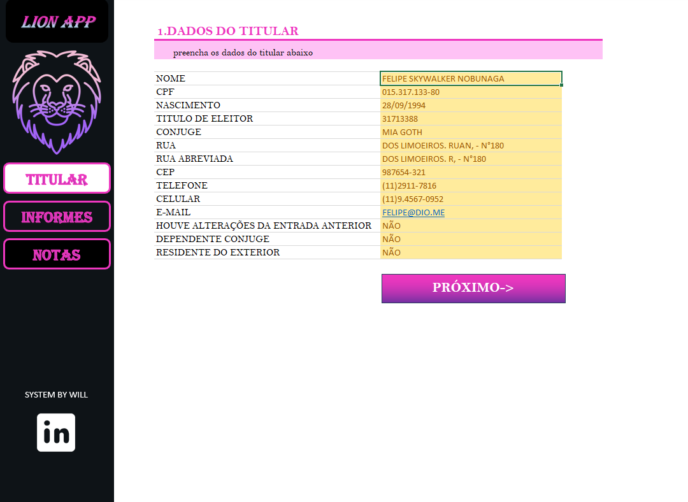
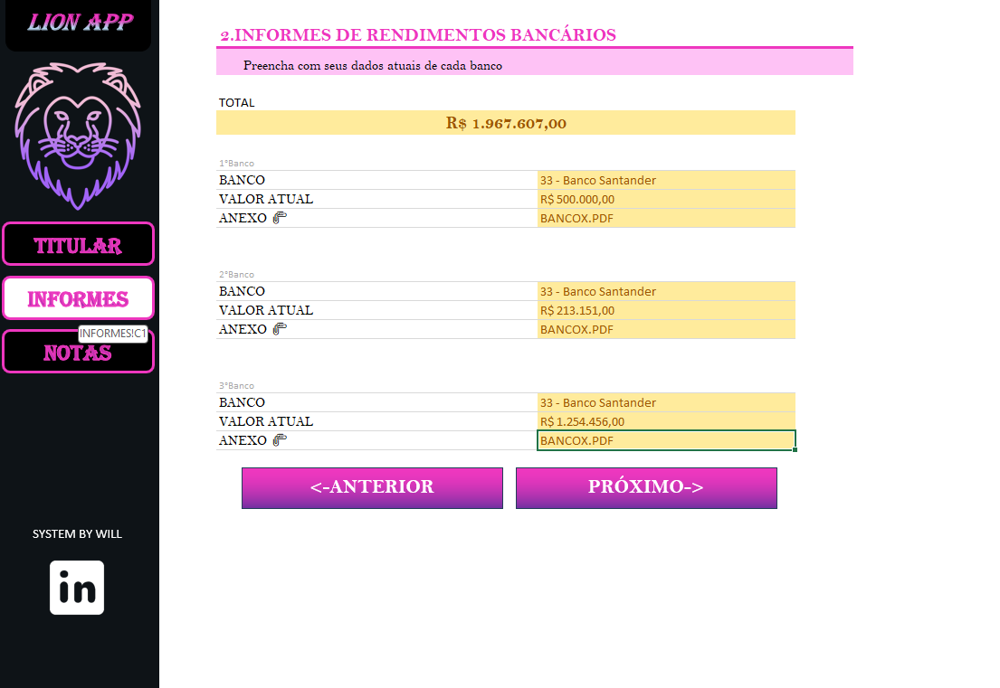
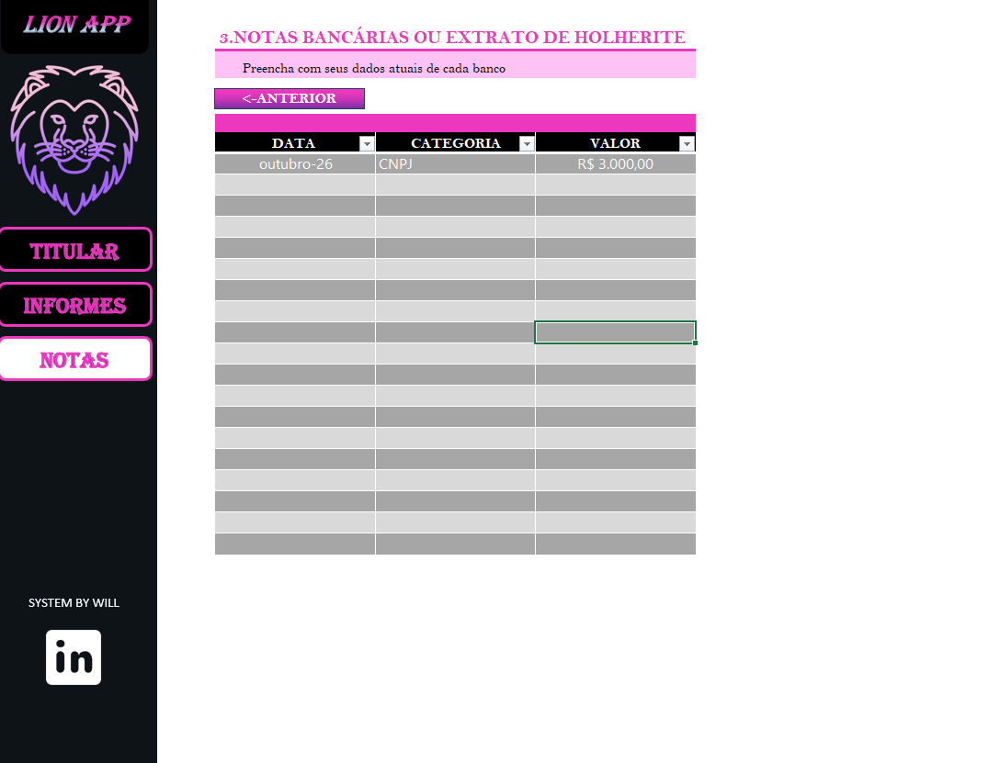

# 🦁 Lion App

Sistema desenvolvido para centralizar e facilitar o preenchimento de dados de um titular, informes bancários e notas financeiras, utilizando planilhas Excel com visual moderno e navegação por abas.

## 📋 Funcionalidades

- **Cadastro do Titular**: Nome, CPF, data de nascimento, endereço, telefone, e-mail, entre outros dados pessoais.
- **Informes de Rendimento**: Registro de rendimentos bancários com totalizador automático e anexos de comprovantes.
- **Notas Bancárias ou Holerite**: Lançamento de datas, categorias e valores financeiros complementares.

## 📂 Estrutura do Projeto

O projeto está estruturado em uma planilha Excel com as seguintes abas:

1. **TITULAR**: Coleta de informações pessoais do titular e dependentes.
2. **INFORMES**: Controle de rendimentos por banco, com upload de comprovantes.
3. **NOTAS**: Lista de lançamentos adicionais como holerites ou notas de CNPJ.

## 🧩 Tecnologias Utilizadas

- Microsoft Excel
- Formatação condicional
- Macros/VBA (opcional para automações)
- Estilo visual com cores e botões interativos

## 💼 Autor

Projeto desenvolvido por Will – _System by Will_

## 📌 Observações

> Este projeto tem fins demonstrativos e educacionais. Os dados contidos nas imagens são fictícios.

---

