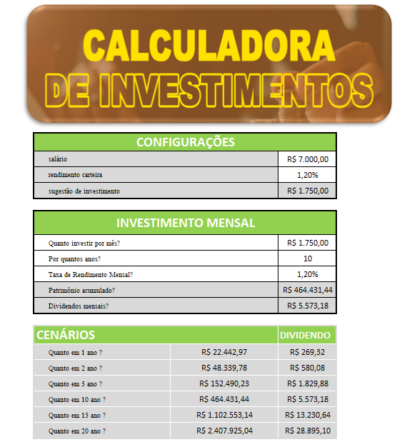

# Calculadora de Investimentos

Repositório: [Estudos](https://github.com/willianlaurito/Estudos.git)

Autor: **Willian**

## Descrição

Este projeto consiste em uma **Calculadora de Investimentos** desenvolvida em Excel, que permite simular e visualizar o crescimento do patrimônio ao longo do tempo, baseado em um aporte mensal, taxa de rendimento e horizonte de investimento.

## 📊 Configurações Utilizadas

| Descrição                 | Valor       |
|-------------------------- |------------ |
| Salário                   | R$ 7.000,00 |
| Rendimento da Carteira    | 1,20%       |
| Sugestão de Investimento  | R$ 1.750,00 |

## 💰 Investimento Mensal

| Descrição                           | Valor       |
|-------------------------------------- |------------ |
| Quanto investir por mês?             | R$ 1.750,00 |
| Por quantos anos?                    | 10 anos     |
| Taxa de Rendimento Mensal            | 1,20%       |
| Patrimônio acumulado                 | R$ 464.431,44 |
| Dividendos mensais                   | R$ 5.573,18 |

## 📈 Cenários de Crescimento

| Cenário               | Patrimônio Acumulado | Dividendos |
|---------------------- |----------------------|----------- |
| Quanto em 1 ano?      | R$ 22.442,97         | R$ 269,32 |
| Quanto em 2 anos?     | R$ 48.339,78         | R$ 580,08 |
| Quanto em 5 anos?     | R$ 152.490,23        | R$ 1.829,88 |
| Quanto em 10 anos?    | R$ 464.431,44        | R$ 5.573,18 |
| Quanto em 15 anos?    | R$ 1.102.553,14      | R$ 13.230,64 |
| Quanto em 20 anos?    | R$ 2.407.925,04      | R$ 28.895,10 |


## 📷 Captura de Tela



## 📁 Arquivos Incluídos

- `Projeto.xlsx` — Planilha com todos os cálculos e simulações.
- `Imagens/IMG1.png` — Captura de tela da calculadora.
- `README.md` — Documentação do projeto.

## 🚀 Como Utilizar

1. Clone o repositório:

```
git clone https://github.com/willianlaurito/Estudos.git

```

2.Navegue até a pasta do projeto:

```

cd Estudos/Projeto Excel IA DIO

```

3.Abra a planilha Projeto.xlsx com Excel ou outro editor compatível:

✅ Objetivo
Este projeto visa reforçar o aprendizado de investimentos e automatização de simulações financeiras utilizando planilhas.


