# 🚀
<h1>
    
     Contribuindo em um Projeto Open Source no GitHub
</h1>

  

<h2 align="center">
  
  Contribuindo no GitHub - Missão DIO
</h2>

  <a href="#-objetivo">🎯 Objetivo</a> •
  <a href="#-ferramentas">🛠️ Ferramentas</a> •
  <a href="#-passo-a-passo">👣 Passo a Passo</a> •
  <a href="#-desafio">🏆 Desafio</a> •
  <a href="#-como-contribuir">🤝 Como Contribuir</a>

---

## 🎯 Objetivo
Aprender a contribuir em projetos open source de forma simples e prática!

  

---

## 🛠️ Ferramentas
| Ferramenta | Para que serve? |
|------------|-----------------|
|  [GitHub](https://github.com) | Plataforma para hospedar projetos |
|  [Git](https://git-scm.com) | Sistema de controle de versão |

---

## 👣 Passo a Passo
1. **Introdução** → Entenda o básico
2. **Formas de Contribuir** → Descubra como ajudar
3. **Enviando Contribuições** → Coloque em prática
4. **Dicas Extras** → Torne-se um expert

  

---

## 🏆 Desafio
**Missão:** Faça um fork deste projeto e contribua com:
- Seu perfil na pasta `community`
- Melhorias no código
- Correções de documentação

> 💡 Dica: Veja exemplos na pasta [`community`](https://github.com/digitalinnovationone/dio-lab-open-source/tree/main/community)

---

## 🤝 Como Contribuir

```mermaid
graph TD
    A[Encontre um projeto] --> B[Faça um fork]
    B --> C[Clone o repositório]
    C --> D[Faça suas alterações]
    D --> E[Envie um Pull Request]
```

**3 formas simples de ajudar:**
1. ✨ Adicione seu perfil
2. 🐛 Corrija problemas (issues)
3. 📚 Melhore a documentação

  

---

## 🌟 Comunidade

  

  Feito com 💜 pela comunidade DIO
   
  

---

### ⚡ Recursos Extras
- [Badges personalizados](https://github.com/digitalinnovationone/dio-lab-open-source/blob/main/utils/badges/badges.md)
- [Cards de estatísticas](https://github.com/digitalinnovationone/dio-lab-open-source/blob/main/utils/cards/github-stats.md)
- [Guia de contribuição](https://github.com/digitalinnovationone/dio-lab-open-source/blob/main/CONTRIBUTING.md)

  

