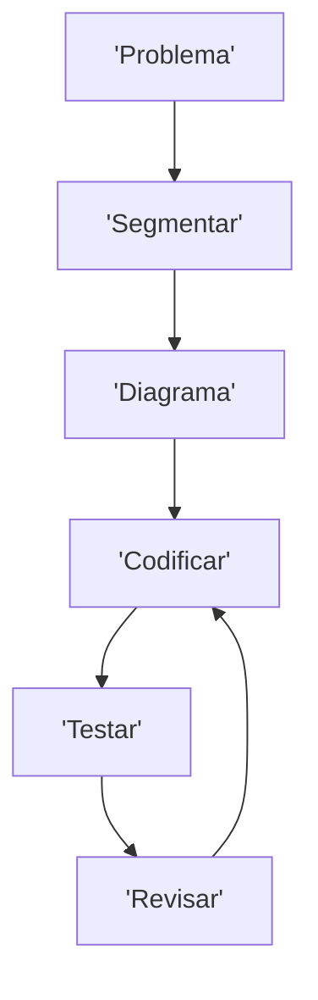

### Olá, meu nome é Bárbara (BabiNoli)😊

## Sobre mim
Eu sou uma programadora iniciante. Em transição de carreira aos 42 anos. 
Atualmente estou cursando Engenharia de Informática na Universidade Aberta de Lisboa. 
E Umschuldung de Fachinformatik als Anwendungsentwicklung em Munique. 
(Significa curso profissionalizante para transição de carreira e desenvolvimento de aplicativos)

Sou muito curiosa e apaixonada pela área de tecnologia, por isso estou sempre me desafiando a aprender coisas novas.

| Idiomas | Nível |
|-----:|---------------|
|  Português  |  Língua materna  |
|  Inglês  |  Intermediário  |
|  Espanhol  |  Intermediário  |
|  Alemão  |  Intermediário  |

| Programação | 
|-----:|
|  Java  | 
|  Python | 
|  C  |
|  JavaScript  |

Rotina de desenvolvimento:

