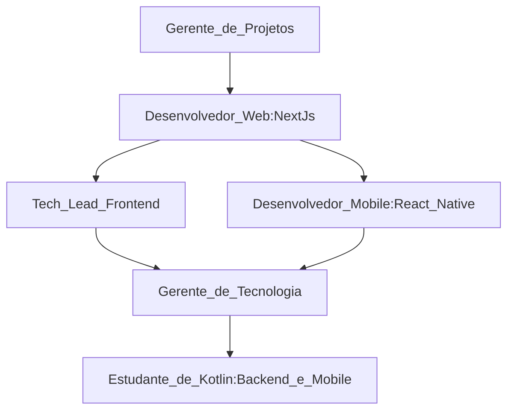

# 👨🏻‍💻 Olá! Sou Francisco Maik

Desenvolvedor frontend apaixonado por criar soluções inovadoras com foco em **React** e **React Native**. Ao longo dos últimos **4 anos**, tenho dedicado minha carreira ao desenvolvimento de aplicações web e móveis, sempre buscando entregar produtos que combinem funcionalidade, usabilidade e design.

## Atuação Profissional

Atualmente, desempenho o papel de **Gerente de Tecnologia**, onde lidero equipes multidisciplinares, garantindo a integração eficiente entre as áreas de desenvolvimento e produto. Minhas responsabilidades incluem:

- Gestão estratégica de projetos, desde a definição de roadmaps até a implementação de ferramentas como **Kanban** e **Gantt**.
- Coordenação da comunicação entre equipes de desenvolvimento e produto.
- Aplicação de metodologias ágeis para maximizar a produtividade e a qualidade das entregas.

## Aprendizado Contínuo

Sempre comprometido com o aprendizado contínuo, estou expandindo meus horizontes no universo do desenvolvimento de software. Atualmente, dedico meus estudos à linguagem **Kotlin**, explorando suas aplicações tanto no **backend** quanto no desenvolvimento **mobile**, com o objetivo de ampliar meu impacto técnico e contribuir para projetos ainda mais robustos e escaláveis.

## Conexões e Colaborações

Se você compartilha da mesma paixão por tecnologia ou deseja colaborar em projetos inovadores, fique à vontade para entrar em contato! Estou sempre aberto a novas oportunidades e trocas de conhecimento.

# 🌐 Socials:

# 💻 Tech Stack:
        

# 📊 Estatísticas GitHub:

   
   
  

# 🛤️ Caminho Profissional
