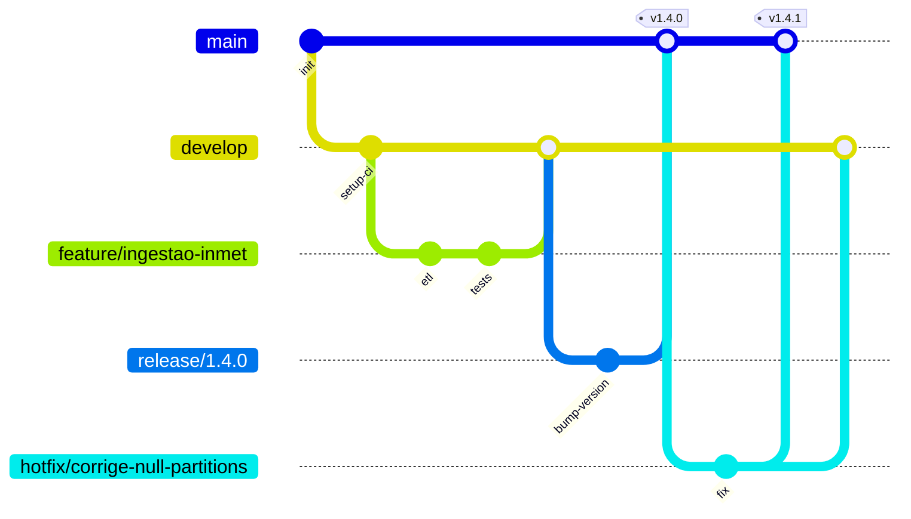

# Boas Práticas de Git para Projetos de **Dados** com **GitFlow**

> Este guia em **Markdown** foi pensado para ser colado diretamente no seu repositório (ex.: `README.md` ou `docs/gitflow.md`). Ele une padrões de engenharia de dados, ciência de dados e MLOps com o fluxo **GitFlow**.

---

## 🧭 Objetivos

* Padronizar o trabalho em times de dados (DA/DS/DE/ML) usando **Git**.
* Definir **GitFlow** (branches, versões, releases, hotfixes).
* Garantir **reprodutibilidade**, **segurança** (sem segredos) e **controle de dados/pesos/modelos**.
* Facilitar **code review**, **CI/CD** e **auditoria**.

---

## 📦 Estrutura Sugerida de Repositório (dados/ML)

```
.
├── data/                 # NÃO versionar dados brutos enormes (use DVC/LFS)
│   ├── raw/
│   ├── interim/
│   └── processed/
├── models/               # artefatos de modelos (via DVC/MLflow/Weights)
├── notebooks/            # Jupyter; usar nbstripout/clean
├── src/                  # pacotes Python/SQL; lógica de ETL/ELT/ML
│   ├── pipelines/
│   ├── features/
│   └── training/
├── tests/                # pytest, Great Expectations
├── configs/              # YAML/JSON de parâmetros (sem segredos)
├── dags/                 # orquestração (Airflow/Prefect)
├── scripts/              # CLIs utilitárias
├── .github/workflows/    # CI/CD (GitHub Actions)
├── .pre-commit-config.yaml
├── .gitignore
├── .gitattributes
└── README.md
```

> **Dado grande ≠ Git.** Use **DVC** (recomendado) ou **Git LFS** para artefatos pesados; Git guarda apenas *metadados*.

---

## 🌳 GitFlow — Visão Geral

**Branches fixas**:

* `main`: produção; sempre **estável**. Tagueada com versões (`vX.Y.Z`).
* `develop`: integração contínua do próximo release; estável **o suficiente**.

**Branches tópicas**:

* `feature/<escopo-kebab>`: novas funcionalidades (ex.: `feature/ingestao-inmet`)
* `release/<versao>`: estabilização para produção (ex.: `release/1.4.0`)
* `hotfix/<descricao>`: correções urgentes em produção (ex.: `hotfix/corrige-null-partitions`)

### Diagrama (Mermaid)



---

## ⚙️ Inicialização do Repositório

```bash
# 1) Inicie Git e proteja branches no provedor (GitHub/GitLab/Bitbucket)
git init

# 2) Configure sua identidade (global ou local)
git config user.name  "Seu Nome"
git config user.email "seu@email"

# 3) Pré-commit hooks para notebooks/estilo
pip install pre-commit nbstripout ruff black isort
pre-commit install

# 4) DVC (opcional, recomendado para dados/modelos)
pip install dvc[gs,s3,azure]
dvc init

# 5) MLflow (opcional, rastreamento de experimento)
pip install mlflow
```

---

## 🧩 .gitignore (essencial)

Exemplo mínimo para projetos de dados/ML:

```gitignore
# Python
__pycache__/
*.pyc
.venv/
.env

# Notebooks
.ipynb_checkpoints/

# DVC
/.dvc/
*.lock
/\.dvc/cache/

# Dados locais (mantidos fora do Git)
/data/**
!/data/.gitkeep         # Mantenha diretórios vazios

# Modelos/artefatos (use DVC/LFS)
/models/**
!/models/.gitkeep

# Credenciais/segredos
secrets.*
*.key
*.pem
*.p12
```

---

## 🧾 .gitattributes (textos vs. binários, LFS opcional)

```gitattributes
# Força LF (Unix) para evitar diffs ruidosos
* text=auto eol=lf

# Trate notebooks como texto (para nbstripout limpar metadados)
*.ipynb filter=nbstripout

# Exemplos de LFS (se não usar DVC)
# *.parquet filter=lfs diff=lfs merge=lfs -text
# *.pkl     filter=lfs diff=lfs merge=lfs -text
# *.bin     filter=lfs diff=lfs merge=lfs -text
```

> **Dica:** Use **nbstripout** para remover outputs e metadados pesados de notebooks.

---

## 🧹 Pre-commit (qualidade automática)

`.pre-commit-config.yaml` (exemplo curto):

```yaml
repos:
  - repo: https://github.com/nbQA-dev/nbQA
    rev: 1.9.1
    hooks:
      - id: nbqa-ruff
        args: ["--line-length=120"]
      - id: nbqa-black
        args: ["--line-length=120"]
  - repo: https://github.com/psf/black
    rev: 24.8.0
    hooks:
      - id: black
        args: ["--line-length=120"]
  - repo: https://github.com/astral-sh/ruff-pre-commit
    rev: v0.6.2
    hooks:
      - id: ruff
  - repo: https://github.com/pre-commit/pre-commit-hooks
    rev: v4.6.0
    hooks:
      - id: end-of-file-fixer
      - id: trailing-whitespace
```

---

## 🧱 Convenções de Nomes

* **Branches:** `feature/<modulo>-<resumo>`, `fix/<bug>`, `release/<versao>`, `hotfix/<resumo>`
* **Commits:** use **Conventional Commits**:

  * `feat: nova ingestão INMET`
  * `fix: corrige timezone em DAG`
  * `docs: adiciona README de pipelines`
  * `chore: atualiza dependências`
  * `refactor: desacopla extrator de transformador`

---

## 🧪 Commits Atômicos e Mensagens Claras

```bash
git add src/pipelines/inmet_extractor.py
git commit -m "feat: adiciona extrator INMET com retries e backoff"
```

**Regra de ouro:** um commit = uma ideia/alteração coesa. Descreva **o que** e **por quê** (não apenas o como).

---

## 🔄 Fluxo de Trabalho Diário (GitFlow “na prática”)

1. **Crie uma issue** descrevendo o objetivo/escopo.
2. **Crie a branch** a partir de `develop`:

```bash
git checkout develop
git pull
git checkout -b feature/ingestao-inmet
```

3. **Commits frequentes** e pequenos; sincronize:

```bash
git add -A && git commit -m "feat: esqueleto do pipeline INMET"
git push -u origin feature/ingestao-inmet
```

4. **Abra PR** → `develop` com checklist (abaixo) e peça review.
5. **Merge squash** (ou rebase) para histórico limpo.

---

## 🧰 Alternativa com Extensão GitFlow (AVH)

Se usar o plugin GitFlow:

```bash
git flow init                    # padrão: main/develop
git flow feature start ingestao-inmet
# ... trabalho ...
git flow feature finish ingestao-inmet  # merge → develop
git flow release start 1.4.0
# ... estabiliza ...
git flow release finish 1.4.0     # tag → m
```
_____