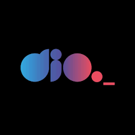

# DIO LAB OPEN SOURCE 
<meta NAME="viewport" content="width=device-width, initial-scale=1.0" />
<title>My Profile - Marcia Moreno</title>
<!--Trabalhando os links relacionais-->
<link REL="stylesheet" TYPE="text/css" HREF="../dio-lab-open-source/css/divgrid.css" />
<link REL="stylesheet" TYPE="text/css" HREF="../dio-lab-open-source/css/estilo-profile.css" />
<link REL="stylesheet" TYPE="text/css" HREF="../dio-lab-open-source/css/noralize.css" />
<link REL="Stylesheet" HREF="../css/noralize.css" />
<link REL="Stylesheet" HREF="../css/estilo-profile.css" />
<link REL="Stylesheet" HREF="../css/divgrid.css" />
<!--Trabalhando os links de edição de fonts-->

    

        

            Diretório responsivo, projeto lançado pelo curso Versionamento de codigo da DIO -
            <a href="https://web.dio.me/track/santander-2024-backend-com-java">[Digital Inovation 
            One]</a>. O desafio visa a colaboração da comunidade entres os estudantes
            do modulo, fazendo-os aprimorar na prática o conceito de contribuição de projetos, 
            via plataforma de codigo aberto no GitHub, cujo script pode ser desenvolvido e validado, 
            tanto pelo diretório local via Git Bash ou VS Code do Windows.
        

   

   

   

    

        
    

    

        
    

    
			
        <h2 class="pacifico-regular"> Welcome to my profile...</h2>
    

    
***O exercico desafio consiste na criação de uma pagina profile dentro do login de usuário de acesso do GitHub, utilizando uma extensão de arquivo markdown, com o titulo README.md. Entre as colaborações se destaca algumas obrigatoriedades como a criação de uma Issues, inserção de commits para validar as alteração, não podendo constar plagios ou cópias de outros projetos que ja foram inseridos dentro da comunidade.  
    

    

        <table>
            <thead>
                <h2 class="ibm-plex-mono-regular name">&nbsp &nbsp MarciaMoreno &nbsp &nbsp</h2>
            </thead>
            <tr>
            <td class="question oswald">First-Name: </td>
            <td class="answer comfortaa">Marcia Patricia</td>
            </tr>
            <tr>
            <td class="question oswald">Last-Name:</td>
            <td class="answer comfortaa">Moreno</td>
            </tr>
            <tr>
            <td class="question oswald">Date-of-Birth:</td>
            <td class="answer comfortaa">02/04/1985</td>
            </tr>
            <tr>
            <td class="question oswald">LINGUAGENS DE MARCAÇÃO E ESTILO:</td>
            <td class="answer">
                
                
                						
            </td>
            </tr>
            <tr>
            <td class="question oswald">LINGUAGENS DE DESENVOLVIMENTO:</td>
            <td class="answer">
                
                
            </td>
            </tr>						
            <tr>
            <td class="question">Sobre mim...</td>
            <td class="answer comfortaa">Brasileira, solteira, não-fumante e sem filhos. Estudante com foco em Desenvolvimento Web pela 
            <a href="https://web.dio.me/track/santander-2024-backend-com-java">DIO - [Digital Inovation One]</a>. 
            Gradução iniciada em Ciencias da Computação pela Instituição de ensino UNIESP - SP (2014). Habilidades 
            e automação de desenho e ilustrações diversas. Conhecimento nos pacotes Officce, trabalho atualmente 
            como Expertise de atendimento para suporte tecnico da ambev, via Teleperformance.   </td>
            </tr>
            <tr>
            <td class="question oswald">Site de conteúdo: </td>
            <td class="answer comfortaa">
                <a href="https://www.youtube.com/channel/UCIl3wm3BjyE4AzxmL5hGm0Q">@marciapatriciam &nbsp&nbsp / &nbsp&nbsp</a><a href="https://www.facebook.com/profile.php?id=61559592734029">facebook</a> / &nbsp&nbsp <a href="linkedin.com/in/marcia-patricia-moreno-68b4b230a"> linkedin</a>
            </td>
            </tr>
            <tr>
            <td class="question oswald"> E-mail:</td>
            <td class="answer comfortaa"> mapat.soad@gmail.com
            </tr>
        </table>
    

    
        
        
     

  

        

            
        

        
			
            <h2 class="pacifico-regular"> Documentação</h2>							
        

    <ul>
        <li><a href="https://git-scm.com/doc"><input class="jersey-25-charted-regular" class="docs" type=button name="OneButton" value="GIT" /></a></li>
        <li><a href="https://docs.github.com/pt"><input class="jersey-25-charted-regular" class="docs" type=button name="OneButton" value="GITHUB" /></a></li>
        <li><a href="https://www.w3schools.com/html/default.asp"><input class="jersey-25-charted-regular" class="docs" type=button name="OneButton" value="HTML 5/ CSS" /></a></li>
    </ul>

  

    

        
    

    
			
        <h2 class="pacifico-regular"> Links relevantes do Git</h2>							
    

    
<a href="https://git-scm.com/docs/git/pt_BR">$ git - O monitor de conteúdos.</a>

    
<a href="https://git-scm.com/docs/git-config/pt_BR">$ git-config - Definições e opções globais do repositório.</a>

    
<a href="https://git-scm.com/docs/git-init/pt_BR">$ git init - Cria um repositório Git vazio ou reinicializa um já existente.</a>

    
<a href="https://git-scm.com/docs/git-add/pt_BR">$ git add - Adicione o conteúdo do arquivo ao índice.</a>

    
<a href="https://git-scm.com/docs/git-branch/pt_BR">$ git Branch - Lista, cria ou exclui ramificações.</a>

    
<a href="https://git-scm.com/docs/git-clone/pt_BR">$ git-clone - Clona um repositório em um novo diretório</a>

    
<a href="https://git-scm.com/docs/git-restore/pt_BR">$ git-restore - Restaura os arquivos das árvores de trabalho</a>

    

        
    

    
			
        <h2 class="pacifico-regular"> Links relevantes do GitHub</h2>							
    

    
<a href="https://docs.github.com/pt/get-started/writing-on-github/getting-started-with-writing-and-formatting-on-github/basic-writing-and-formatting-syntax">Sintaxe básica de gravação e formatação markdown no GitHub.</a>

    
<a href="https://docs.github.com/pt/get-started/writing-on-github/working-with-advanced-formatting/creating-and-highlighting-code-blocks">Criar e realçar blocos de código</a>.

    
<a href="https://docs.github.com/pt/get-started/learning-about-github/github-glossary">Glossário do GitHub.</a>

    
 Copyright © 2024 - MarciaMoreno 

