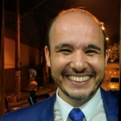

# FRANCISCO FERREIRA DE ARAUJO
“Estudante de pós-graduação em Engenharia de IA, desenvolvendo soluções inteligentes com Python.”

  

## Resumo 

Atualmente, estou em transição de carreira para a área de Tecnologia da Informação. Sou estudante de graduação em Análise e Desenvolvimento de Sistemas pelo SENAC SP e estou cursando uma pós-graduação em Engenharia de Inteligência Artificial pela Universidade Cruzeiro do Sul. Além desses cursos, tenho me dedicado a outras formações na área de Tecnologia.

Minha experiência anterior inclui atividades no Laboratório de Refrigeração, onde desenvolvi e orientei tecnicamente o desenvolvimento de produtos na parte funcional (elétrica e refrigeração). Realizei montagem e testes de balanceamento do sistema de refrigeração de diversos modelos de produtos, utilizando software específico e termopares para controlar a temperatura ambiente, avaliando-o tanto sem carga (vazio) quanto com carga.

Minhas responsabilidades incluíam emitir relatórios de aprovação ou reprovação de produtos e componentes, elaborar fichas técnicas relativas à parte funcional dos produtos, e realizar visitas técnicas a clientes para coletar informações e dados a serem trabalhados nos laboratórios. Também ofereci suporte às áreas de Produção, Qualidade e Pós-Venda.

Agora, estou focado em aplicar meus conhecimentos e habilidades na área de Tecnologia da Informação, com especial interesse em Inteligência Artificial e Desenvolvimento de Sistemas...

## Contato

 
     11957397660 (Mobile) 

 fferreira.araujo@hotmail.com  

 www.linkedin.com/in/francisco-ferreira-de-araujo-1b432033
 
 [GitHub: araujofran](https://github.com/araujofran)

  <h2>Competências</h2>
  

Python para Data Science

Java

Inteligência artificial

  <h2>Certificados</h2>
  
  <ul style="list-style: none; padding: 0; display: inline-block; text-align: left;">
    <li>GIT E GITHUB</li>
    <li>ALGORITMO [40 HORAS]</li>
    <li>PYTHON 3 - MUNDO 3 [40 HORAS]</li>
    <li>Introdução à inteligência artificial no Azure</li>
    <li>PYTHON 3 - MUNDO 1 [40 HORAS]</li>
  </ul>

## Experiência

**Metalfrio Solutions**  
_Tecnico de Refrigeração_  
fevereiro de 2015 - Present (9 anos 8 meses)  
São Paulo e Região, Brasil  
Trabalhando na Engenharia de Desenvolvimento de Produtos, especificamente no Laboratório de Refrigeração…

**FEI (Faculdade de Engenharia)**  
_Tecnico de Ensino_  
março de 2014 - janeiro de 2015 (11 meses)

**Senai Oscar Rodrigues**  
_Instrutor de refrigeração_  
fevereiro de 2011 - janeiro de 2014 (3 anos)

**Electrolux**  
_Tecnico de refrigeração_  
abril de 2012 - março de 2013 (1 ano)

## Formação

**Cruzeiro do Sul Virtual**  
Pós-graduação Lato Sensu - Especialização Engenharia de Inteligência Artificial, Tecnologia da Informação  
(outubro de 2023 - dezembro de 2024)

**Senac São Paulo**  
Análise e Desenvolvimento de Sistemas, Tecnologia da Informação  
(agosto de 2022 - fevereiro de 2024)

**FATEC PROFº MIGUEL REALE - ITAQUERA**  
Tecnologia de Refrigeração e Ar Condicionado, Tecnologia em Manutenção de Aparelhos de Refrigeração e Climatização  
(2014 - 2017)

**Universidade Metodista de São Paulo**  
Bacharel em Teologia, Teologia  
(2007 - 2012)
