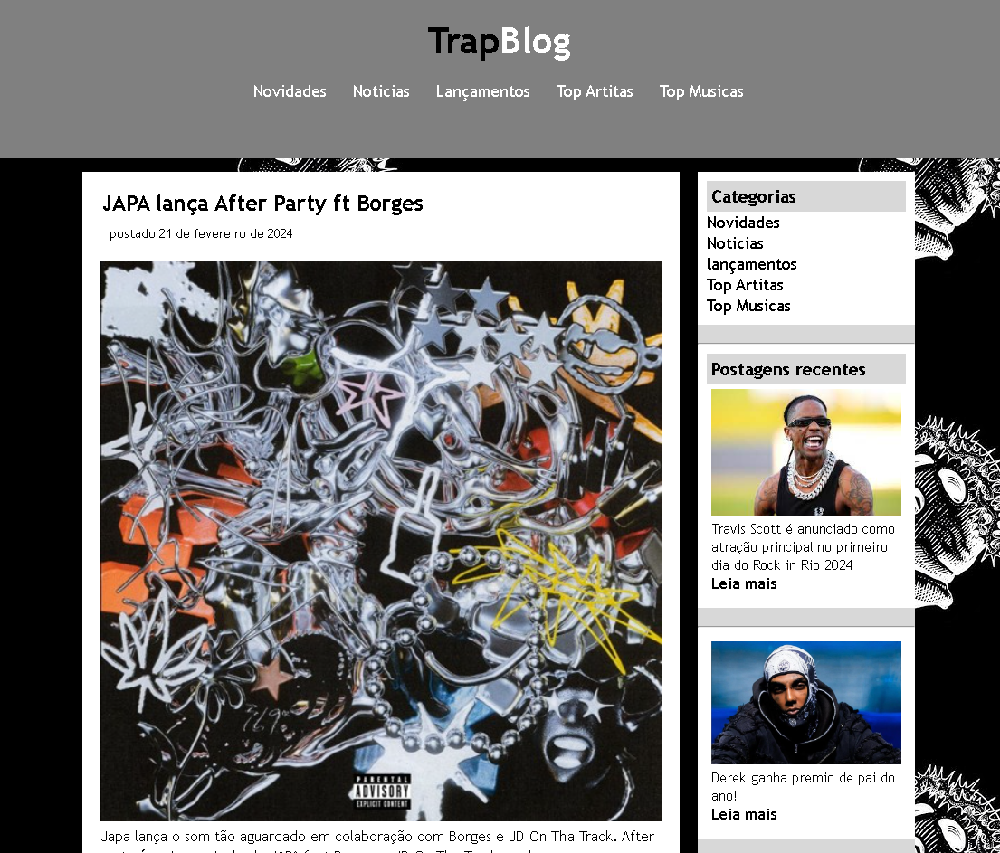
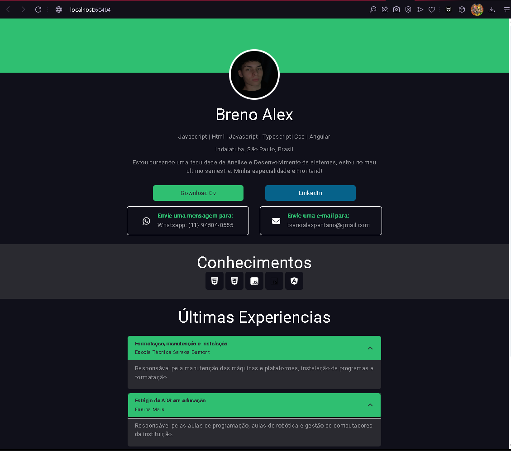
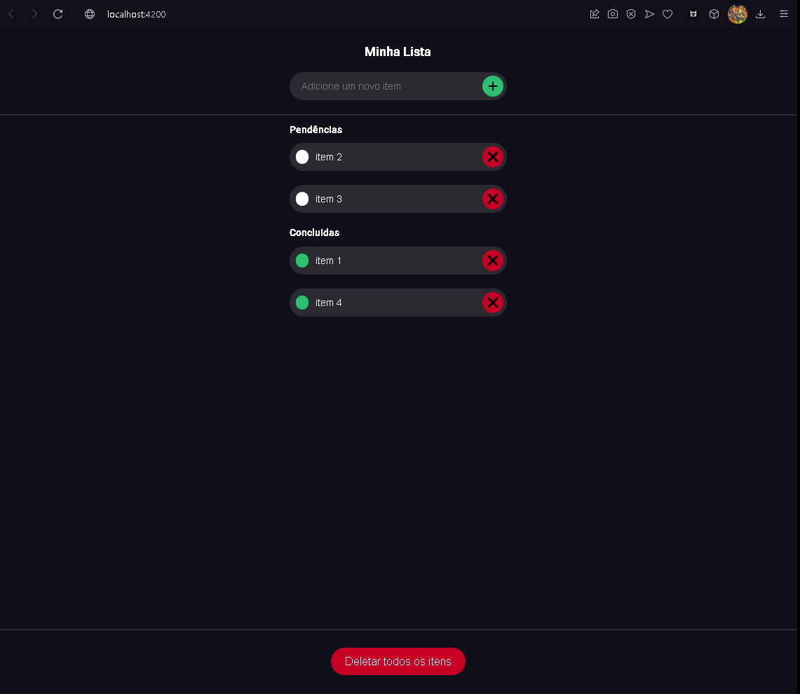

# Breno Alex Cavalcante

##  Apresentação
Oi, tudo bem? Espero que sim.
Meu nome é Breno Alex, tenho 19 anos e estou cursando Análise e Desenvolvimento de Sistemas. Sou também músico e possuo uma experiência diversificada em várias empresas, atuando desde a programação até o ensino de informática e robótica. Atualmente, trabalho na área de política de relacionamento e estou em busca de oportunidades que me permitam crescer junto com a empresa.

Nos meus momentos de lazer, sou apaixonado por videogames e futebol, que são grandes hobbies para mim. Estou sempre em busca de novos desafios e oportunidades para aplicar minhas habilidades e continuar me desenvolvendo profissionalmente. Muito obrigado por dedicar um pouco do seu tempo em conhecer meu perfil! Grande abraço à todos!

# Conecte-se comigo
Vamos conversar sobre programação, podemos nós ajudar muito!

## Habilidades
Cursos finalizados:

Cursos em andamento:

# Projetos feitos

### Primeiro projeto:
Esse é um blog que eu decidir fazer bem no começo quando eu estava aprendendo Html e Css3, é algo mais descontraído. 

### Outros projetos:
Enquanto estudava angular, fiz dois projetos.
O primeiro é um portfólio meu, e o segundo é uma lista de tarefas

####  Portfólio:

####  Lista de tarefas:

# Agradecimentos 
Agradeço sinceramente pelo tempo dedicado a revisar meu GitHub. Caso tenha interesse em conversar ou discutir possíveis oportunidades, estarei à disposição para entrar em contato. Muito obrigado pela consideração!

