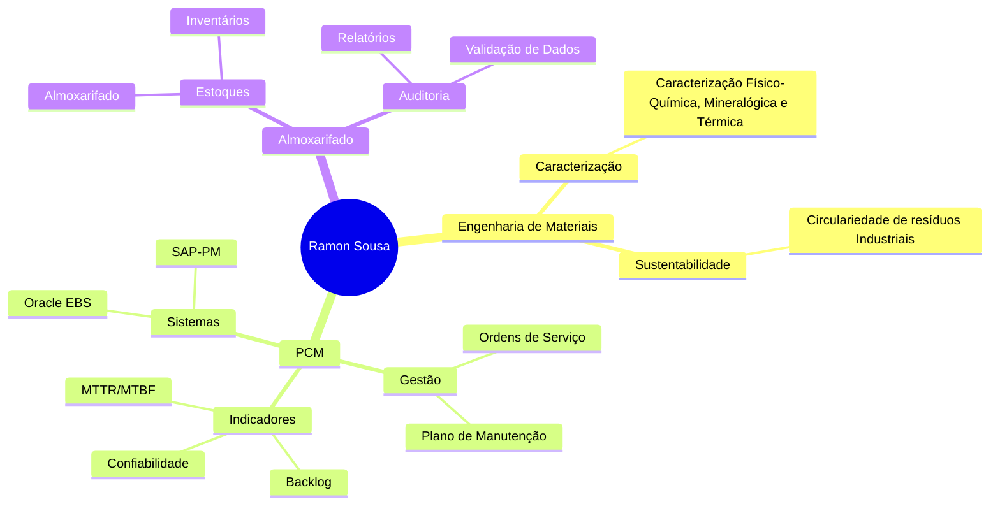

  
# 👨‍💼 Ramon Sousa dos Santos

  

<!-- GIF Central - Programador em Ação -->

  

---

## 🎓 Formação Acadêmica

  <table>
    <tr>
      <td>
        
      </td>
    </tr>
    <tr>
      <td align="center">
        <strong>Instituto Federal do Pará (IFPA)</strong> 
        <em>Agosto 2021 – Agosto 2026</em>
      </td>
    </tr>
  </table>

---

## 💼 Experiência Profissional

 <table> <tr> <td align="center"> <strong>GEQ – Nacional Gás Butano Distribuidora LTDA</strong>  <em>Estagiário em PCM | Junho 2025 – Atualmente</em> </td> </tr> <tr><td> <ul align="left"> <li>⚙️ Acompanhamento de ordens de serviço e planos de manutenção preventiva</li> <li>📊 Atualização de indicadores: <strong>MTTR, MTBF, confiabilidade e backlog</strong></li> <li>🛠️ Apoio na organização de fluxos de manutenção e análise de falhas</li> <li>💻 Domínio das ferramentas <strong>SAP-PM</strong> e <strong>Oracle EDS</strong></li> </ul> </td></tr> </table> 
   
 <table> <tr> <td align="center"> <strong>RGIS – Freelancer</strong>  <em>Auxiliar de Auditoria | Agosto 2024 – Fevereiro 2025</em> </td> </tr> <tr><td> <ul align="left"> <li>🔍 Contagem física de produtos e conferência de inventário</li> <li>✅ Apoio na validação de dados de estoque e movimentação de mercadorias</li> <li>📑 Organização de relatórios de contagem para suporte à auditoria</li> </ul> </td></tr> </table> 
   
 <table> <tr> <td align="center"> <strong>Corpo de Bombeiros Militar do Estado do Pará (CBMPA)</strong>  <em>Auxiliar Administrativo | Março 2021 – Março 2023</em> </td> </tr> <tr><td> <ul align="left"> <li>📊 Controle de estoque com uso de planilhas e sistemas</li> <li>🚚 Apoio logístico na distribuição de materiais às unidades</li> <li>📁 Gestão de contratos, convênios e execução de rotinas administrativas</li> </ul> </td></tr> </table> 

## 🎯 Áreas de Atuação

## 📈 Competências Técnicas

| Área               | Nível | Experiência                                                                                                                                                  |
| ------------------ | ----- | ------------------------------------------------------------------------------------------------------------------------------------------------------------ |
| **SAP-PM**         | ⭐⭐⭐⭐ | Gestão eficiente de manutenção industrial, acompanhamento de OS, planos preventivos e corretivos, monitoramento de indicadores (MTTR, MTBF, confiabilidade). |
| **Oracle EBS**     | ⭐⭐⭐⭐⭐ | Análise e tratamento de grandes volumes de dados para suporte à tomada de decisão, extração e validação de informações.                                      |
| **Excel Avançado** | ⭐⭐⭐⭐⭐ | Desenvolvimento de macros em VBA, criação de dashboards interativos, uso avançado de fórmulas, tabelas dinâmicas e automação de processos.                   |
| **Power BI**       | ⭐⭐⭐⭐⭐ | Criação de dashboards dinâmicos e relatórios interativos para transformar dados em insights e monitoramento de KPIs.                                         |
| **Lean Six Sigma** | ⭐⭐⭐  | Aplicação de metodologias para melhoria contínua, redução de desperdícios e otimização de fluxos de trabalho.                                                |
| **PCM**            | ⭐⭐⭐⭐ | Planejamento e controle de manutenção com foco em organização de OS, programação preventiva/corretiva e monitoramento de desempenho.                         |

---

## 📫 Como me encontrar

---

  <h3>💡 "A inovação na engenharia começa com a sustentabilidade e eficiência"</h3>
  
Sempre em busca de soluções que unam tecnologia, eficiência e responsabilidade ambiental! 🌱⚙️

---

