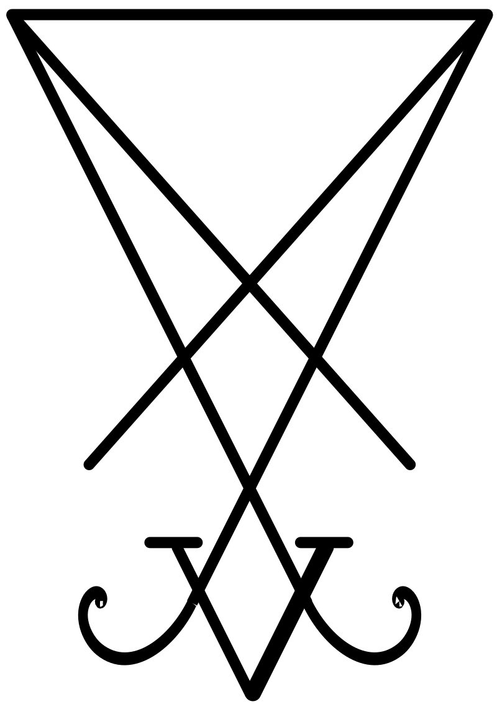

### Olá, eu sou o Gabriel Simas (gabrielsimas) 👋

## O Daimon da Programação

✨ **Sênior Fullstack Software Engineer** na Simasoft e Analista de Sistemas há mais de 25 anos.

🏢 **Atuação Profissional**
- 🚀 Senior Fullstack na Thera Solutions alocado na TV Globo desde 2019.

### 📊 Estatísticas no GitHub

### 🚀 Linguagens Mais Usadas

