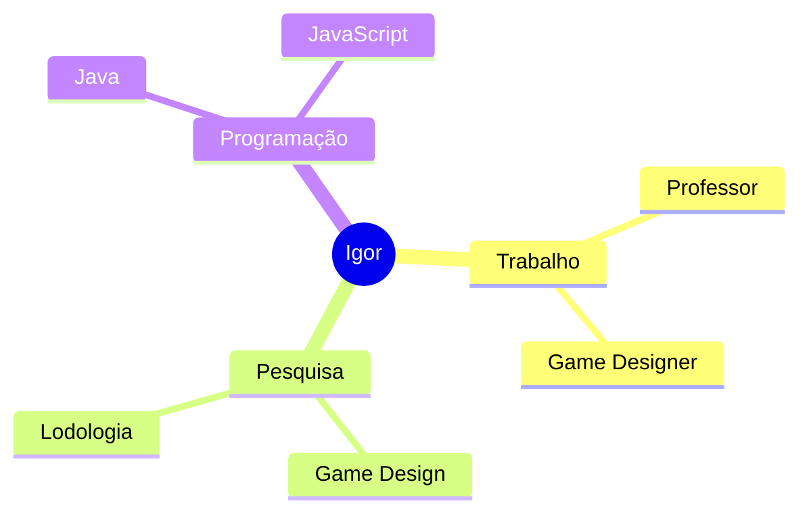

# Igor
Hello, world!

```mermaid
mindmap
  root((Igor))
    Trabalho
    ::icon(fas fa-briefcase)
      Professor
      ::icon(fa fa-book)
      Game Designer
        ::icon(fas fa-puzzle-piece)
    Pesquisa
    ::icon(fas fa-microscope)
      Game Design
      ::icon(fas fa-gamepad)
      Lodologia
      ::icon(fas fa-dice)
    Programação
    ::icon(fas fa-laptop-code)
      Java
      ::icon(fab fa-java)
      JavaScript
      ::icon(fab fa-js-square)
```

## Conecte-se comigo

## Habilidades

 

## GitHub Stats

