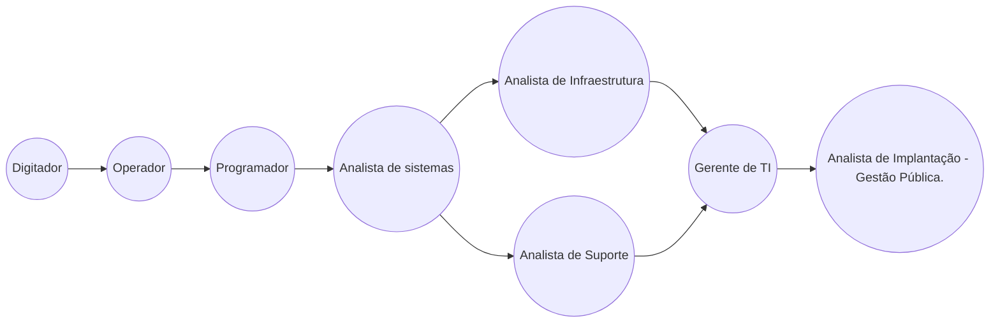

# juliotecnologia | DIO desafio

Este arquivo faz parte do projeto [Dio](dio.me) - Santander. Como primeiro desafio proposto, criar um **profile**  em arquivo .md local para depois compartilhá-lo na pasta [community](community) do projeto.

## Julio Cesar Jesus
Profissional de TI desde 1995, já atuei nas mais diversas áreas do setor, atuando hoje como analista de suporte e implantação de sistemas voltados para a gestão pública, mais exatamente em setores ligados à tributação e ISS.

## Conecte-se comigo
|  |  |  |  |
|--|--|--|--|

## Linha do tempo profissional

## Github Status

