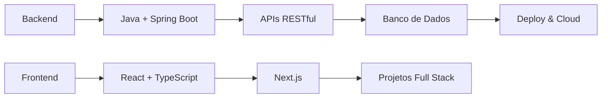

<div align="center">

<!-- Header animado com wave -->


<!-- Animação de digitação moderna -->


<!-- Badges animados -->
<div align="center">
  
  
  
  
</div>

<!-- Link do Portfolio em destaque -->
<div align="center" style="margin: 20px 0;">
  <a href="https://omoshaa.github.io/portfolio/">
    
  </a>
</div>

<!-- Linha animada separadora -->


</div>

---

## 🧑‍💻 Sobre Mim

```typescript
const desenvolvedor = {
  nome: "Moisés Filipe Telis de Lima",
  localização: "Campinas, SP - Brasil 🇧🇷",
  educação: "Colégio Técnico de Campinas - UNICAMP",
  curso: "Desenvolvimento de Sistemas",
  nível: "Jovem Padawan 🌱",

  linguagens: ["Java", "JavaScript", "TypeScript", "Python", "SQL"],
  frameworks: ["Spring Boot", "Node.js", "React", "Next.js"],
  ferramentas: ["Git", "Docker", "VS Code", "IntelliJ IDEA"],
  cloud: ["GCP", "AWS (básico)"],

  foco: "Backend & Full Stack",
  objetivo: "Primeira oportunidade profissional",
  motivação: "Transformar curiosidade em código! 🚀",
};

console.log(`${desenvolvedor.nome} está ${desenvolvedor.motivação}`);
```

---

## 🛠️ Stack Tecnológico

<div align="center">

### **🚀 Tecnologias que uso**

<!-- Ícones das tecnologias principais -->


### **⚙️ Ferramentas & Infraestrutura**


</div>

<br>

<!-- Grid moderno e limpo -->
<div align="center">
<table>
<tr>
<td align="center" width="50%">

### 💻 **Linguagens**


</td>
<td align="center" width="50%">

### 🎯 **Frameworks**


</td>
</tr>
<tr>
<td align="center">

### 🗄️ **Bancos de Dados**


</td>
<td align="center">

### ☁️ **Nuvem e DevOps**


</td>
</tr>
</table>
</div>

<!-- Separador animado -->


---

## 🚀 Projetos & Estudos

**Projetos de Aprendizado:**

- 📚 Exercícios práticos e tutoriais
- 🏗️ Projetos acadêmicos
- 🧪 Experimentos com novas tecnologias

**Focos Atuais:**

- ☕ Backend com Java & Spring Boot
- 🌐 APIs RESTful e microserviços
- 🗄️ Banco de dados e modelagem SQL
- 🔧 Clean Code & boas práticas

[Ver todos os repositórios](https://github.com/omoshaa?tab=repositories)

---

## 📈 Estatísticas GitHub

<div align="center">

<!-- Grid de estatísticas animadas -->
<table>
<tr>
<td>
  
</td>
<td>
  
</td>
</tr>
</table>

<!-- Streak com animação -->


<!-- Gráfico de atividades -->


<!-- Troféus -->


</div>

---

## 🌱 Aprendizado & Objetivos



**Objetivos 2025:**

- ✅ Concluir curso técnico com excelência
- 🎯 Dominar Java + Spring Boot
- 🚀 Construir 5+ projetos completos
- 💼 Conseguir primeira oportunidade como dev
- 🌟 Contribuir em projetos open source

---

## 🌟 Destaques & Conquistas

<div align="center">

<!-- Badges de conquistas -->
<table>
<tr>
<td align="center">
  
  <br><sub>Consistência nos estudos</sub>
</td>
<td align="center">
  
  <br><sub>Sempre evoluindo</sub>
</td>
<td align="center">
  
  <br><sub>Adorando desafios</sub>
</td>
</tr>
</table>

</div>

---

## 📬 Vamos Conectar!

<div align="center">

### 🤝 **Sempre aberto para conversar sobre:**

_Programação • Oportunidades • Projetos colaborativos • Dicas de estudo_

<!-- Links sociais com animação -->
<table>
<tr>
<td align="center">
  <a href="https://www.linkedin.com/in/moisés-filipe-568412297">
    
  </a>
</td>
<td align="center">
  <a href="mailto:moiseisfelipi@gmail.com">
    
  </a>
</td>
</tr>
<tr>
<td align="center">
  <a href="https://www.instagram.com/dupe_mosh/">
    
  </a>
</td>
<td align="center">
  <a href="https://discord.com/users/1390894666752327690">
    
  </a>
</td>
</tr>
</table>

### 🎯 **Procurando por:**

Mentoria • Projetos colaborativos • Estágios • Primeira oportunidade profissional

---

<!-- Quote animado -->


<!-- Footer animado -->


**💫 Sempre aprendendo, sempre crescendo, sempre codando!**


</div>
