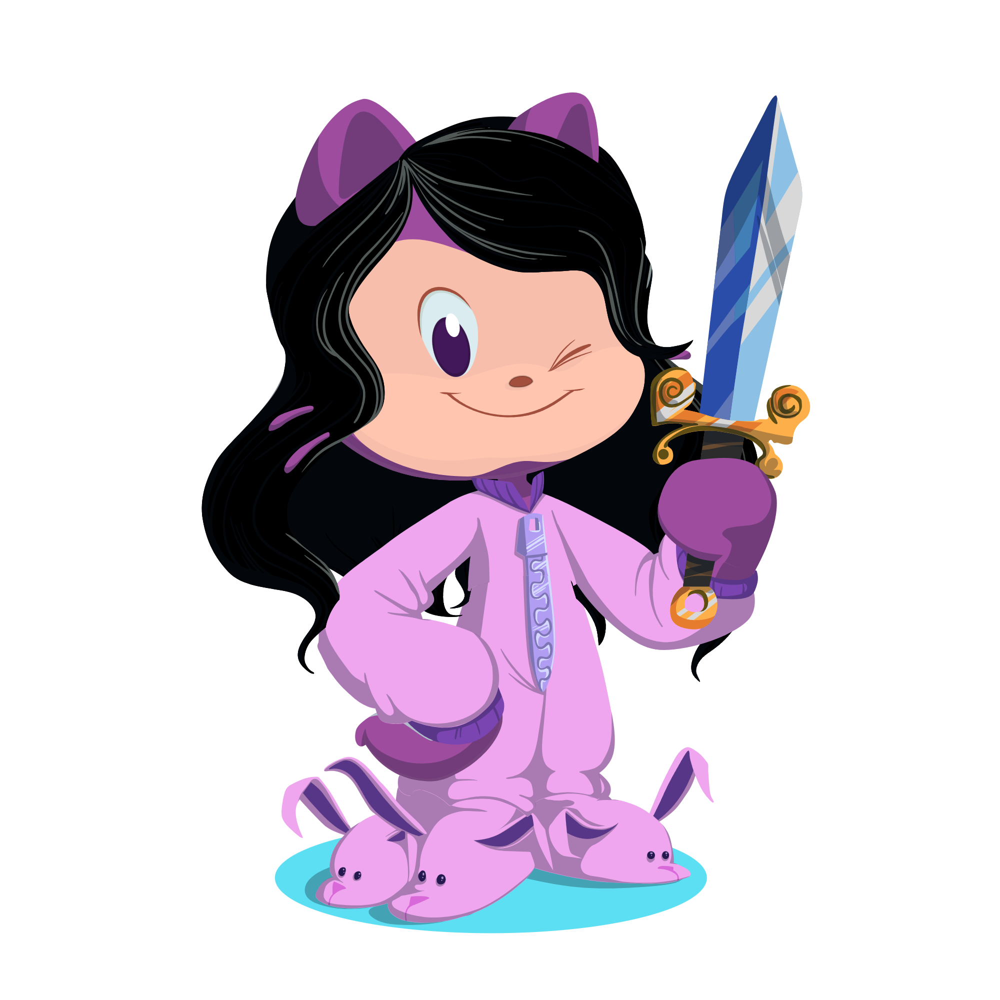

# Olá, eu sou a Mariana Régia! 👋

<h2>🚀 Sobre mim</h2>

Eu sou estudante de engenharia de dados, ciências da computação  
e ciências e tecnologia pela Universidade Federal do ABC. 

Atualmente estou me especializando na área de análise de dados.

Além disso, tenho também outros interesses, como:
- Culinária
- Leitura
- Jogos
- Assistir séries de época

<h2> 🛠 Habilidades</h2>

 

 

 

<h2> 🔗 Conecte comigo </h2>

    

