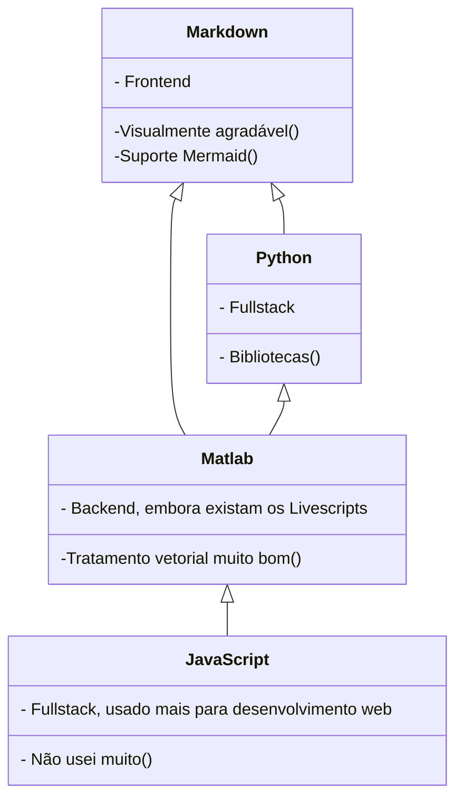

# LorenzaBriz0t0 - Overview

---


## Sobre mim: 

---

### Resumo:

---

Estudante de Engenharia Aeronáutica na USP, sempre fui apaixonada por games e o universo da ficção científica, caminho que abriu portas para a minha afinidade com dispositivos aeroespaciais e deselvolvimento de software. Talvez, inconscientemente, eu esteja tentando chegar o mais perto o possível de ser alguém como Anakin Skywalker.
### Algumas Curiosidades

---
- Sou também escritora ~~publicada~~ de Poesia
- Sou guitarrista
- Gosto de Rock dos anos 70 e 80
- Sou natural de Curitiba - PR
- Torço para o Coritiba
- Também acompanho o Real Madrid
- Meu jogo favorito é Galaxy on Fire 2
- Gosto muito de ler
- Sou Cristã
- Apaixonada pelo livro de Romanos

Sobre esse último tópico, gostaria de deixar registrado e em evidência que:

---
> Veio, porém, a lei, para que a ofensa abundasse; mas onde abundou o pecado, superabundou a graça; 
> 
  — Romanos 6:20.
## Sobre Programação

---
Comecei adquirindo minhas primeiras noções de programação com ```JavaScript``` , mas não tive tanta prática com essa linguagem e acabei não me desenvolvendo muito. 

Durante a faculdade de engenharia, fui introduzida ao ```Matlab```, que, embora não seja exatamente uma linguagem, a grosso modo, me ajudou bastante a construir fundamentos de algorimos. Aqui na USP, pelo menos até alguns anos atrás, a programação era mais utilizada para tratamento computacional de métodos numéricos, então foi assim que eu aprendi a utilizar o software. O tratamento vetorial dele é excelente, e por isso é utilizado em muitas aplicações de engenharia de forma geral.

Percebendo, assim, com o ``` Matlab``` que eu tinha certa afinidade com a programação, comecei a aprender ```Python``` no Youtube e com a ajuda de Fóruns, como é bastante natural.
Hoje em dia, meus scripts feitos em ```Matlab``` têm bastante cara de scripts de ``` Python ```.

Gostaria de dedicar um leve parágrafo para ``` Markdown```. Não tinha nenhum repertório de FrontEnd ~~porque tenho postergado aprender LateX por tempo demais~~ e estou gostando bastante de aprender com ele. Descobri algumas funcionalidades visuais legais, como o suporte à sintaxe Mermaid. Tive várias ideias legais sobre isso, até porque diagramas de blocos são **muito** úteis para a engenharia.

Aproveitando a deixa, abaixo deixo um fluxograma ilustrativo sobre essas linguagens em **Mermaid**:

---


## Contato

---
Para mais informações e canais oficiais de comunicação:

[](https://github.com/LorenzaBriz0t0)
[](https://www.linkedin.com/in/lorenza-brizoto-0b1165252/)
[](mailto:lbrizoto22@usp.br)