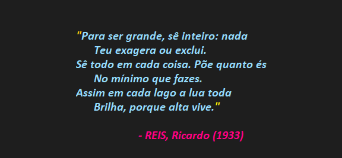

#  Olá, eu sou a Amanda Barbosa! 

Este arquivo possui a descrição do meu perfil para contribuir com o projeto Open Source e trazer um pouco mais sobre mim, minhas habilidades e tecnologias, links para contato e outras curiosidades. 

## 🚀 Sobre mim
Sou desenvolvedora Beck-end Java e estou estudando e me especializando para evoluir profissional e pessoalmente!

⚡️ Fatos engraçados...
* Nasci em agosto de 1998 no interior de São Paulo
* Sou trigêmeas e tenho um irmão mais velho
* Adoro fazer desenhos nas minhas unhas no meu tempo livre
* Gosto de ler

⚡️ Para se inspirar...

## 🛠 Linguagens de programação, bibliotecas e frameworks

 
## 📫 Como entrar em contato comigo...

## 🔗 Links
* [Complete list of github markdown emoji markup](https://gist.github.com/rxaviers/7360908)
* [Tabela de cores](https://www.flextool.com.br/tabela_cores.html)

