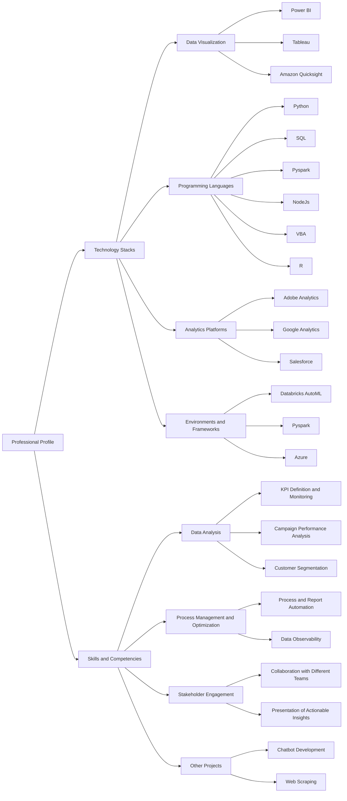

## Hello, I'm Alef Spinella
> Senior Data Analyst [@Grupo Casas Bahia](https://github.com/viavarejo) | Data Insight Specialist

## Social profiles

## Key Hard and Soft Skills

```mermaid
graph LR
  EX[Professional Profile] --> A[Technology Stacks]
  EX --> 1[Skills and Competencies]

  A[Technology Stacks] --> B[Data Visualization]
  A --> C[Programming Languages]
  A --> D[Analytics Platforms]
  A --> E[Environments and Frameworks]

  B --> G[Power BI]
  B --> H[Tableau]
  B --> H1[Amazon Quicksight]

  C --> J[Python]
  C --> K[SQL]
  C --> K1[Pyspark]
  C --> K2[NodeJs]
  C --> K3[VBA]
  C --> K4[R]

  D --> Q[Adobe Analytics]
  D --> Q2[Google Analytics]
  D --> R[Salesforce]

  E --> T[Databricks AutoML]
  E --> U[Pyspark]
  E --> V[Azure]

  1[Skills and Competencies] --> 2[Data Analysis]
  1 --> 3[Process Management and Optimization]
  1 --> 4[Stakeholder Engagement]
  1 --> 5[Other Projects]

  2 --> 6[KPI Definition and Monitoring]
  2 --> 7[Campaign Performance Analysis]
  2 --> 7.1[Customer Segmentation]

  3 --> 10[Process and Report Automation]
  3 --> 10.1[Data Observability]

  4 --> 13[Collaboration with Different Teams]
  4 --> 15[Presentation of Actionable Insights]

  5 --> 16[Chatbot Development]
  5 --> 17[Web Scraping]

```
