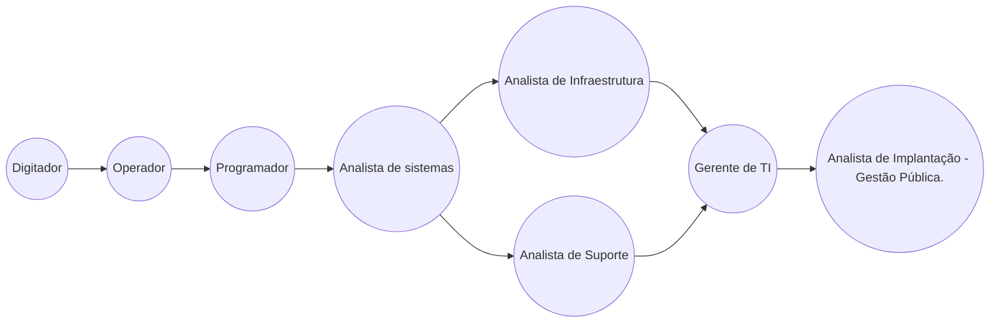

# juliotecnologia | DIO desafio

Este arquivo faz parte do projeto [Dio](dio.me) - Santander. Como primeiro desafio proposto, criar um **profile**  em arquivo .md local para depois compartilhá-lo na pasta [community](community) do projeto.

## Julio Cesar Jesus
Profissional de TI desde 1995, já atuei nas mais diversas áreas do setor, atuando hoje como analista de suporte e implantação de sistemas voltados para a gestão pública, mais exatamente em setores ligados à tributação e ISS.


## Conecte-se comigo
| [](https://www.linkedin.com/in/jcjulio/) | [](https://www.facebook.com/jcjulio/) | [](https://www.instagram.com/meumundosc/) | [](https://x.com/meumundosc) |
|--|--|--|--|

## Linha do tempo profissional


## Github Status
[](https://git.io/streak-stats)


## Convenção de commits

### Summary
A especificação da Convenção de Commits é uma leve convenção sobre mensagens em commits. Ela oferece um conjunto de regras fácil para criar um histórico explícito de commits, o que facilita escrever ferramentas de automações sobre isso.
A mensagem de commit pode ser estruturada como a seguir:

```
 $ < tipo >[ escopo opcional ]: < descrição >
 [ corpo opcional ] 
 [ rodapé opcional ] 
```
O commit contem a seguinte estrutura de elementos para comunicar a intenção aos consumidores de sua biblioteca:

 1. **fix**: um commit de tipo ```fix``` informa a correção de um bug na sua codebase.
 2. **feat**: um commit do tipo ```feat``` introduz uma nova feature para a codebase.
 3. **BREAKING CHANGE**: um commit que tem um rodapé ```BREAKING CHANGE```, ou inclui um ```!``` após o tipo/escopo, introduzindo uma última novidade de API, correlacionando com maior no Versionamento Semântico ([SemVer](http://semver.org/)).

### Mensagem de commit com descrição e breaking change footer

```
feat: allow provided config object to extend other configs

BREAKING CHANGE: `extends` key in config file is now used for extending other config files

```

### Mensagem de commit com `!` para chamar a atenção para a breaking change

```
feat!: send an email to the customer when a product is shipped

```

### Mensagem de commit com escopo e `!` para chamar a atenção para a breaking change

```
feat(api)!: send an email to the customer when a product is shipped

```

### Mensagem de commit com ambos `!` e BREAKING CHANGE footer

```
chore!: drop support for Node 6

BREAKING CHANGE: use JavaScript features not available in Node 6.

```

### Mensagem de commit sem "corpo" 

```
docs: correct spelling of CHANGELOG

```

### Mensagem de commit com escopo

```
feat(lang): add Polish language

```

### Mensagem de commit com corpo de multi-parágrafos e múltiplos rodapés

```
fix: prevent racing of requests

Introduce a request id and a reference to latest request. Dismiss
incoming responses other than from latest request.

Remove timeouts which were used to mitigate the racing issue but are
obsolete now.

Reviewed-by: Z
Refs: #123

```
