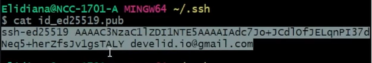
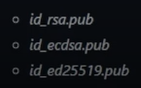

# Autenticando via Chave SSH

&nbsp;&nbsp;&nbsp;&nbsp; O GitHub possui outro método de segurança que é a chave SSH (Security Shell) é um protocolo de rede que possibilita que o computador local e o servidor remoto que eles se conectem de forma segura e criptografada por meio da internet.

**Passo a Passo**  

1. Abra o GitBash;
2. Escreva o comando: 
`ssh-keygen -t ed25519 -c "digite seu email aqui"`;
3. Quando for solicitado a inseir um arquivo para salvar a chave, pressione "Enter" para aceitar o local padrão do arquivo;
4. No prompt, digite uma frase secreta segura;
5. Digite o comando  
`eval "$(ssh-agent -s)`;
6. Adicione sua chave SSH privada ao ssh-agent, utilizando esse comando:
`ssh-add ~/.ssh/id_ed25519`;
7. Adicione a cjave SSH à sua conta GitHub;
8. Dentro do GitHub, no profile a sua direita cantp superior;
9. Entrar em "Settings";
10. Canto esquerdo tem um menu, entrar em "SSH and GPG keys";
11. Em "SSH keys" no botão ao lado "New SSH key";
12. Preencher os campos "title" descreva o nome da maquina onde criou a chave;
13. Em "key type" você coloca o tipo da chave autenticação ou por assinatura, selecionar "Authentication Key";
14. Em "key" você irá colocar sua chave pública, precisando ir dentro do arquivo onde foi criado a chave, segue o passo a passo abaixo;
* no Git Bash >> comando `cd ~/.ssh` >> ls (mostará os nome dos arquivos dentro do documento .ssh onde o arquivo com a extensão `.pub` é onde estará a chave publica) >> ``cat id_ed25519.pub`` >> aparecerá o numero da chave igual ao que está selecionado abaixo >> só copiar e colocar no campo "key".
15. Finalizar, irá solicitar uma confirmação colocando autenticação por senha ou dois fatores.

 
> &nbsp;&nbsp;&nbsp;&nbsp;Esse protocolo trabalha com um par de chaves, onde uma chave é publuca e outra chave privada, ao se conectar por meio do SSH você se autentica utilizando o arquivo da chave privada que fica presente no seu computador, a chave privada ela equivale a uma senha onde você não pode expor ela, o que será inserido no GitHub será a chave pública.

* [documentação](https://docs.github.com/en/authentication/connecting-to-github-with-ssh) do SSH

**Verificação padrão de chave SSH existente**

1. Aba o Git Bash;
2. Insira o comando: 
`ls -al ~/.ssh` ele mostrará se possui algum diretrório com a extensão `.ssh`, se ele existir.
3. Verefique a lsitagem do diretório para verificar se você já tem uma chave SSH publica. Por padrão, os nome de arquivos de chaves públucas compátiveis para o GitHub são um dos mostrados a seguir:

 

### REFERÊNCIAS

---

Material didático fornecido dentro da plataforma: 

* Você encontrará em: Versionamento de Código com Git e GitHub/Instalação e Configuração e Autenticação

> Digitalizado em arquivo `.md` para melhor acesso ao conteúdo e podendo ser baixado para serem feitos anotações ou mesmo para fins de leitura apenas.