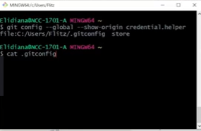

# Autenticação via Token
> O Git não depende da plataforma do GitHub para estar sendo feito o versionamento, ele é apenas um meio de arquivar de forma online seu repositórios. 
>    *Exemplo:*  
> O git armazena seus arquivos em um repositório local, ou seja, guardado na sua máquina, com isso caso aconteça algo com sua maquina, vinculando com o GitHub repositório remoto, de qualquer lugar você consegue recuperar seus arquivos.

O Token ele é um meio de segurança que o GitHub encontrou para uma segurança melhor, pois assim as pessoas sentirão mais confiaça em guardar seus arquivos na plataforma.

*Seus beneficios:* 
1. Único -> Especifico do GitHub, onde por ser gerado por uso ou por dispositivo;
2. Revogaveis -> Eles podem ser revogaveis individualmente, sem a necessidade de estar revogando as credenciais que não forem afetadas;
3. Limitado -> a pessoa que for usar o token, pode estar com suas funcções limitada;
4. Aleatório -> Evita a tentativa de força bruta.

## Como Criar o Token

1. No canto superior direito, você verá um foto onde é o seu perfil;
2. Ao clicar na imagem entrar em "Settings";
3. Ao entrar, desça a página, no canto inferior a esquerda, entrar em "Developer settings";
4. No canto inferior esquerdo, clicar na opção "Personal access tokens" e depois "Tokens (Classic)";
5. Clicar em "Generate New Token";
6. Selecionar a opção "Generate new token (classic)";
7. Digite a senha sua senha do GitHub;
8. Após a confirmação da senha irá redirecionar para uma página de configuração do Token;
9. Você deve preencher "note" descrição do que é esse token que esta sendo gerado;
10. "Expiration" por quanto tempo esse token ficará ativo;
* Após passado esse tempo deverá criar um novo token.
11. "Select scopes" aqui você defini uma limitação para quem tem esse token dentro do GitHub.
12. Ao finalizar em "Generation token", irá redirecionar para a página com o numero do token criado, copiar e usar;
* **observação:** o número gerado não fica salvo, você tem guardar ele para poder estar usando novamente, para guardar dentro do git bash, você utilizará esses comando: 
&nbsp;&nbsp;&nbsp;&nbsp;1. Precisa utilizar o token 1x dentro do gitbash; 
&nbsp;&nbsp;&nbsp;&nbsp;2. Ao utilizar pela primeira vez, após utilizar o comando `git config --global credential.helper cache`(no cache indicado nos casos em que você divida o usuario com alguem) ou no `store` (se só você usa o computado - aqui, uma vez colocado e configurado não pedirá o token irá direto ate ele expire).
    > obs: para visualizar quando expira seu token, basta fazer o mesmo caminho na instrução de como gerar o token.

## Credential Store 
Para ver onde foi configurado para salvar seu token 
&nbsp;&nbsp;&nbsp;&nbsp;`git config --global credential.helper`
Aparecerá se você armazenou no store ou no cache, conforme configuração na instrução acima;
Obs: Caso queira alterar novamente basta seguir a mesma instrução colocando o local onde quer armazenar novamente.

Para saber onde esta guardado essas configurações dentro do computador, basta digitar o comando  
&nbsp;&nbsp;&nbsp;&nbsp; `git config --global --show-origin credential.helper`
Aparecerá o caminho do local de armazenamento.

Dentro da pasta para acessar o arquivo digite o comando 
&nbsp;&nbsp;&nbsp;&nbsp;`cat .gitconfig` 
cat = exibe o conteudo do arquivo 
.gitconfig = é o nome do arquivo

Dentro da mesma pasta possui o arquivo `.git-credencial` onde está armazenado o numero do seu token salvo anteriormente.
