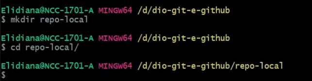
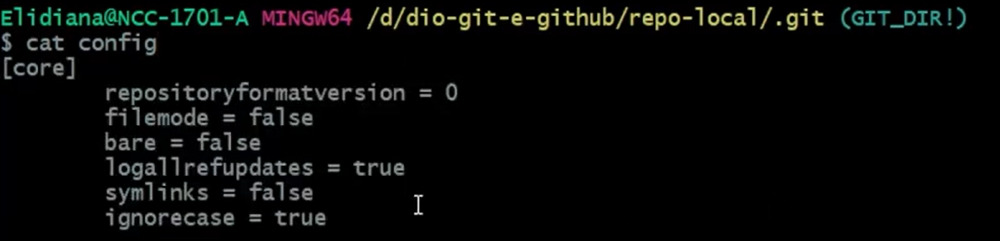
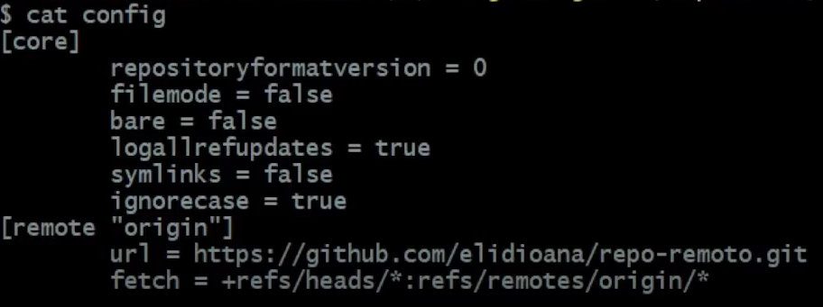
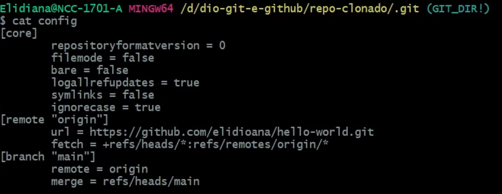

### 1 | Transformando duas formas de obter um repositório Git na sua máquina
***
* ***Ferramenta utilizada: <ins>Git Bash</ins>***

**&rarr; Criando uma pasta [diretório] **
&nbsp; `mkdir` [nome_da_sua_pasta];

**&rarr; Entrando dentro da pasta  **
&nbsp; `cd` [nome_da_sua_pasta]

> Para você saber onde você está conforme a imagem acima, onde esta escrito de amarelo mostra o caminho onde você está dentro do sistema (obs: o nome que ta na imagem não será o mesmo que o seu pois depende de cada usuário).

**&rarr; Transformando essa pasta num repositório  **
&nbsp; `git init` 
* Verá que após essa etapa, o aparecerá uma **(main)** na frente onde mostra o caminho da sua pasta, esse é o nome da sua branch confirmando que deu certo a criação do repositório.

* Você pode confirmar, entrando na pasta `cd .git` onde aparecerá na frente do caminho da sua pasta **(GIT_DIR !)**

**&rarr; Visualizando as informações do seu repositório  **
&nbsp; `cat config`

* As informações demonstrada acima são alguns dados sobre a pasta, onde não foi explicado muito afundo sobre eles, mas eles serão utilizados como base para quando for feito o clone de um repositório.

**&rarr; Para acrescentar ao repositório remote, você irá sair de dentro do arquivo `.git` utilizando o comando `cd ..`, fará com que você volte para dentro da pasta que foi criada;**

**&rarr; Dentro da pasta, para vincular ao um repositório dentro do github, você pode criar um repositório novo ou utilizar algum que você já tenha dentro do seu github. Dentro do repositório na aba "code" haverá um botão na cor verde também chamado "code" ao clicar irá aparecer uma URL (Utilizar a HTTPS)**

&rarr; Utilizando o comando 
&nbsp;`git remote add origin [COLE AQUI A URL OBTIDA DO GITHUB]`

&rarr; Ao entrar dentro do arquivo `.git`, utilize novamente o comando `cat config`

* Aparecerá agora o servidor ao qual está vinculado dentro do github.

### 2 | Clonando um repositório Git existente
***
 

**&rarr; Entrar pelo seu navegador no seu github;  **
**&rarr; Entrar em um repositório que você queira clonar;  **
**&rarr; Na aba "Code" haverá um botão verde também chamado "code" ao clicar na seta aparecerá uma URL, copiar.  **

> HTTPS não solicita senha, e em SSH solicitará uma senha publica que deverá ser configuarada (essa configuração estará em uma outra aula).

**&rarr; No Git Bash, digite os comandos  **
&nbsp; `git clone [COLE A URL AQUI]` 
* nesse comando o nome da pasta virá o mesmo do qual você clonou caso queira usar outro nome você utilizará o comando 
`git clone [COLE A URL AQUI] [DIGITE AQUI O NOME DA PASTA]`

**&rarr; Aqui você verá a diferença de informações dentro da pasta comparado com a que vimos anteriormente quando foi criado uma nova pasta e não clonado; **
&nbsp; Entrar dentro do arquivo `.git` (conforme vimos lá em cima) e digite o código `cat config`

* &nbsp; Aparecerá a mensagem acima, onde ao clonar veio informações *remote* (origin é o nome padrão que ele dá para o servidor de onde foi clonado, dá para mudar mas o ideal é manter esse padrão mesmo) e *branch* (main que é o nome padrãoo da primeira branch do repositório, podendo ser feito outras branch que será ensinado em outra aula).  
&nbsp; Para ver quais repositório esta sendo vinculado basta digitar o comando 
&nbsp; `git remote -v`

***Clonando apenas uma branch sem ser a main/master*** 

&rarr; Caso você queira apenas fazer um clone de uma branch especifica você irá utilizar os comandos
&nbsp; `git clone [COLAR A URL DO REPOSITÓRIO AQUI] --branch [NOME DA BRANCH QUE QUER CLONAR] --single-branch`

* Caso você não passe o nome da branch que você queira clonar, ele irá clonar a branch principal (main/master).

### Criando um repositório dentro do GitHub 

&rarr; Dentro da sua conta em GitHub, no seu perfil, terá uma aba "repositories", dentro dele você verá um botão escrito "NEW" ao clicar irá redirecionar a uma página para criar o repositório;  
**General** 
1. Em "repository name" coloque o nome que você deseja do repositório;
2. "Description" descreva qual é o seu projeto, falar um pouco sobre;  

**Configuration** 
1. "Choose Visibilty" você escolha quem pode ver, Public = todo mundo ou Privite = só você;
2. "Add README" o ideal é sempre ter um readme que é onde você ira descrever o projeto, apresentar ou dependo dar instruçãoes de como funciona;
3. "Add .gitignore" aqui você irá escolher quais tipos de arquivos você não quer que coloquem dentro da pasta;
4. "Add License" você escolherá umas das licenças para o seu projeto, MIT é a mais utilizada, você pode estar dando uma estudada melhor nesta parte que existem outras opções.

Depois de tudo confirgurado, basta clicar em "Create repository"

  
## ATALHOS

| ATALHO      | O QUE FAZ   |
| ----------- | ----------- | 
|    ou  `clear` | Limpa a tela |
|
