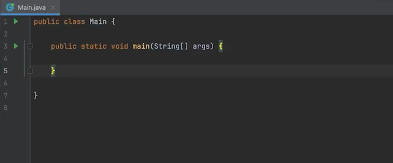

# Instalação de IDEs e Execução do seu Primeiro Programa Java

> Foi descrito o passo a passo nesse conteúdo apenas do Intellij que a IDE que será usado durante seu ensinamento em Java. 
> Nas videos aulas, é mostrado do VSCode e do Eclipse.

## Instalação da Intellij

* *para windows*

1. Site oficial para download [Intellij](https://www.jetbrains.com/idea/download/?section=windows);
2. Após baixar a pasta, executar, mantendo suas configurações padrões (next), até chegar em finish.

> Como uso windows só coloquei aqui o passo a passo do windows, pois esse conteúdo eu uso para meus fins didático mas qui compartilhar caso achem o conteúdo muito rápido ou não estiverem entendendo algo.

## Executando o primeiro programa no Intellij

> Para quem não consegue instalar uma ferramenta IDE, no inicio dessa video aula ele explica ferramentas online para rodar o java.

&nbsp;&nbsp;&nbsp;&nbsp;Ao entrar pela primeira vez na plataforma ou mesmo ao criar um projeto novo, a própria IDE possui estrutura padrão como >idea  >out >External Libries (são ferramentas existente do próprio JDK e caso adicione leads externas, aqui que elas ficarão).

&nbsp;&nbsp;&nbsp;&nbsp; A pasta ao qual iremos trabalhar é a >src.

&nbsp;&nbsp;&nbsp;&nbsp; Dentro do escopo, já vem um templete do java, como na imagem abaixo

&nbsp;&nbsp;&nbsp;&nbsp; Composta por:
`public` = refere-se ao acesso;
`class Main` = definição de uma classe seguida por `{}` onde mostra seu escopo;
`public static void main(string[] args) {}`  = método principal do Java, a partir desse método é onde começa toda a execução de qualquer programa Java; 

* `string[]` = `string...`

* Só não terá esse método caso você vá fazer uma libev que você queira disponibilizar recurso para algueme estar consumindo, pois será uma libev que não é para ser executada e sim consumida para um projeto.

&nbsp;&nbsp;&nbsp;&nbsp; Comando para mostrar mensagem no console:
`system.out.println("hello world");`

* Para acessar o terminal na versão mais atual (deste ano 2025), esta la parte inferior a esquerda.

> A partir daqui o professor irá mostrar um pouco da funcionalidade do Java dentro da IDE, utilizando algumas sintaxes, **MAS PARA ESTAR ENTENDO PRECISA ENTENDER DE ALGORITIMO E LÓGICA DE PROGRAMAÇÃO**

### Materiais de Apoio

***
Os materiais de apoio que oferecemos têm como objetivo fornecer informações para facilitar e enriquecer a sua jornada de aprendizado no curso "Introdução ao Java e seu Ambiente de Desenvolvimento". Aqui você encontrará links úteis, como slides, repositórios e páginas oficiais, além de dicas sobre como se destacar na DIO e no mercado de trabalho 😉

**Slides**
 

Esta na mesma pasta que esse arquivo [GitHub/DIO_lab-open-source/material_apoio_aulas/Java]

**Dicas e Links Úteis** 
Para se desenvolver ainda mais e se destacar na DIO e no mercado de trabalho, sugerimos os seguintes recursos:

* **Artigos e Fórum da DIO:** Compartilhe seus conhecimentos e dúvidas através dos [artigos](https://web.dio.me/articles) (visíveis globalmente na plataforma da DIO) e nos fóruns específicos para cada experiência educacional, como nossos Bootcamps.
* **Rooms:** Participe do Rooms, uma ferramenta de bate-papo em tempo real onde você pode interagir com outros participantes dos nossos Bootcamps, compartilhando dúvidas, dicas e snippets de código.
* **Exploração na Web:** Utilize motores de busca para aprofundar seu conhecimento sobre temas específicos. Páginas como o [StackOverflow](https://stackoverflow.com/questions) são recursos valiosos para encontrar soluções e expandir seu entendimento.

### REFERÊNCIAS

***
Material didático fornecido dentro da plataforma:

* Você encontrará em: Entendendo a Configuração Java e seu Ambiente de Desenvolvimento/Instalação de IDEs e Execução do seu Primeiro Programa Java/Materiais de Apoio.
Digitalizado em arquivo `.md` para melhor acesso ao conteúdo e podendo ser baixado para serem feitos anotações ou mesmo para fins de leitura apenas.
